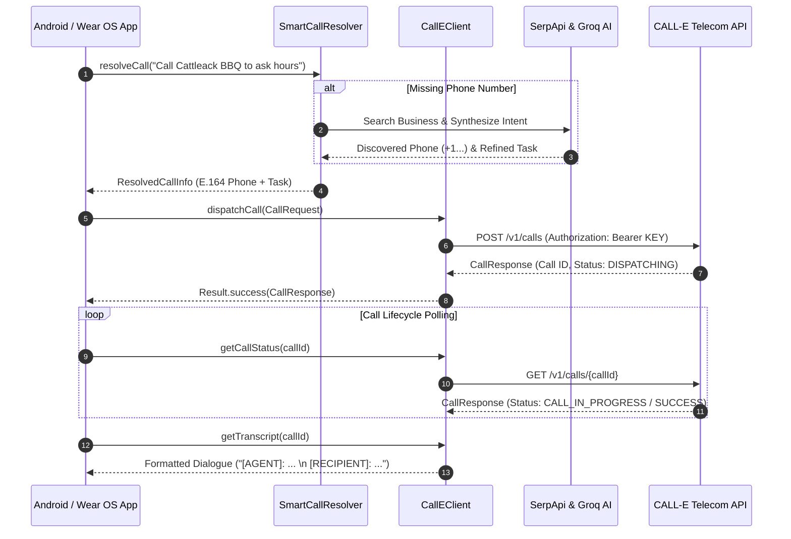

# CALL-E Android SDK (`calle-android`) 📱

[](https://kotlinlang.org)
[](https://developer.android.com)
[-brightgreen.svg)](https://developer.android.com/about/versions/oreo)
[](LICENSE)

**`calle-android`** is the official, enterprise-grade Kotlin SDK for integrating [CALL-E](https://heycall-e.com) AI voice agents into native Android and Wear OS applications. 

Designed for Coroutines-first architecture, `calle-android` allows mobile and wearable developers to dispatch autonomous AI phone calls, track real-time call states, extract turn-by-turn dialogue transcripts, and automatically resolve business phone numbers online via SerpApi & Groq LLM synthesis.

---

## 📐 SDK Architecture & Flow



---

## ✨ Features

- 📞 **One-Line Autonomous Call Dispatch**: Trigger AI phone agents with customizable prompts and automatic E.164 phone formatting.
- 🔍 **AI-Powered Business Search (`SmartCallResolver`)**: Users don't need to know the phone number! Pass raw queries like *"Call Cattleack BBQ in Farmers Branch"*, and the SDK searches Google via SerpApi and synthesizes the exact call target using Groq AI.
- 📊 **Real-Time Lifecycle Tracking**: Monitor call execution across `READY`, `DISPATCHING`, `CALL_IN_PROGRESS`, `SUCCESS`, and `FAILED` states.
- 💬 **Transcript & Audio Extraction**: Parse turn-by-turn speaker logs (`[AGENT]` vs `[RECIPIENT]`), summaries, and cloud recording URLs (`recording_url`).
- 🎨 **Jetpack Compose UI Component (`CallEStatusBadge`)**: Ready-to-use animated status badge with customizable compact/full layouts.
- 🧪 **Offline Sandbox / Demo Mode**: Pass `"DEMO_KEY"` to test end-to-end UI flows without consuming API credits or requiring network connectivity.
- ⌚ **Wear OS & Mobile Optimized**: Built on Ktor Engine and `kotlinx.serialization` for zero memory bloat and rapid execution within Wear OS Doze limits.

---

## 🛠️ System Requirements

| Requirement | Minimum Version |
| :--- | :--- |
| **Android Min SDK** | API Level 26 (Android 8.0 Oreo) |
| **Target SDK** | API Level 34+ (Android 14) |
| **Kotlin Version** | 1.9.0+ |
| **JDK Version** | Java 17+ |
| **Coroutines** | `kotlinx.coroutines` 1.7+ |

---

## 📦 Installation & Setup

### 1. Add Gradle Dependency

Add the SDK dependency to your module's `build.gradle.kts` (App or Wear module):

#### Kotlin DSL (`build.gradle.kts`)
```kotlin
dependencies {
    // Official Remote Maven / GitHub Release
    implementation("com.github.Baklolman69:calle-android:1.0.0")

    // Or for multi-module project reference:
    // implementation(project(":calle-android"))
}
```

#### Groovy DSL (`build.gradle`)
```groovy
dependencies {
    implementation 'com.github.Baklolman69:calle-android:1.0.0'
}
```

### 2. Configure Android Permissions

Ensure your `AndroidManifest.xml` includes internet access permissions:

```xml
<manifest xmlns:android="http://schemas.android.com/apk/res/android">
    <uses-permission android:name="android.permission.INTERNET" />
    <uses-permission android:name="android.permission.ACCESS_NETWORK_STATE" />
</manifest>
```

---

## 🚀 Quick Start Guide

### Step 1: Initialize `CallEClient`

Create an instance of `CallEClient` using your CALL-E API key.

```kotlin
import com.calle.sdk.CallEClient

// Initialize for Production
val client = CallEClient(apiKey = "sk_live_your_api_key_here")

// Initialize for Testing / Offline Demo Mode
val demoClient = CallEClient(apiKey = "DEMO_KEY")
```

---

### Step 2: Validate API Key Credentials

Verify your API key before presenting action buttons to users:

```kotlin
import kotlinx.coroutines.launch

lifecycleScope.launch {
    val isValid = client.validateApiKey()
    if (isValid) {
        println("CALL-E API key is active!")
    } else {
        println("Invalid API key or network error.")
    }
}
```

---

### Step 3: Dispatch an AI Phone Call

Dispatch a call task by providing the recipient phone number (or raw prompt) and task instructions:

```kotlin
import com.calle.sdk.models.CallRequest
import com.calle.sdk.models.CallResponse

lifecycleScope.launch {
    val request = CallRequest(
        toPhoneNumber = "+15550199000",
        promptInstructions = "Inquire about opening hours tonight and vegetarian menu options."
    )

    val result: Result<CallResponse> = client.dispatchCall(request)

    result.onSuccess { response ->
        println("Call Dispatched Successfully!")
        println("Call ID: ${response.id}")             // e.g. "call_a1b2c3d4"
        println("Initial Status: ${response.status}")   // e.g. "CALL_IN_PROGRESS"
    }.onFailure { error ->
        println("Call Dispatch Failed: ${error.message}")
    }
}
```

---

### Step 4: Track Call Status & Summary

Poll the call execution state to get live updates, summaries, and recording links:

```kotlin
lifecycleScope.launch {
    val callId = "call_a1b2c3d4"
    val result = client.getCallStatus(callId)

    result.onSuccess { response ->
        println("Current Status: ${response.status}")
        println("AI Summary: ${response.bestSummary}")
        println("Audio Recording URL: ${response.bestRecordingUrl}")
    }
}
```

---

### Step 5: Retrieve Turn-by-Turn Audio Transcripts

Fetch formatted transcripts separating `[AGENT]` and `[RECIPIENT]` dialogue turns:

```kotlin
lifecycleScope.launch {
    val transcriptResult = client.getTranscript(callId = "call_a1b2c3d4")

    transcriptResult.onSuccess { transcript ->
        println(transcript)
        /*
          Output:
          [AGENT]: Hello! I'm calling to check your opening hours for tonight.
          [RECIPIENT]: Hi! We are open until 10:00 PM tonight.
          [AGENT]: Great, do you have vegetarian options available?
          [RECIPIENT]: Yes, we have a full vegetarian menu section.
        */
    }
}
```

---

## 🧠 Advanced Features

### 1. Smart Business Search & Phone Discovery (`SmartCallResolver`)

If your user only types or speaks a business name (without knowing the phone number), use `SmartCallResolver`. It uses **SerpApi** (Google Search) and **Groq LLM** to discover the phone number and structure a precise call task:

```kotlin
import com.calle.sdk.data.SmartCallResolver
import com.calle.sdk.data.ResolvedCallInfo

val resolver = SmartCallResolver(
    serpApiKey = "YOUR_SERPAPI_KEY",
    groqApiKey = "YOUR_GROQ_API_KEY"
)

lifecycleScope.launch {
    val resolvedInfo: ResolvedCallInfo = resolver.resolveCall(
        rawPrompt = "Call Cattleack Barbeque in Farmers Branch to ask opening hours",
        onStatusUpdate = { status -> println("Progress: $status") }
    )

    println("Resolved Phone: ${resolvedInfo.phone}")             // +19726440167
    println("Business Name: ${resolvedInfo.businessName}")       // Cattleack Barbeque
    println("Refined Prompt: ${resolvedInfo.refinedPrompt}")     // Call +19726440167 and ask Cattleack Barbeque...

    // Dispatch using resolved phone and prompt
    val request = CallRequest(
        toPhoneNumber = resolvedInfo.phone,
        promptInstructions = resolvedInfo.refinedPrompt
    )
    client.dispatchCall(request)
}
```

---

### 2. Jetpack Compose Animated Status Badge (`CallEStatusBadge`)

Include the pre-built `CallEStatusBadge` in your Jetpack Compose UI to reflect live call lifecycle changes with animated status pulses:

```kotlin
import androidx.compose.runtime.*
import com.calle.sdk.ui.CallEStatusBadge
import com.calle.sdk.models.CallEStatus

@Composable
fun CallStatusScreen(currentStatus: CallEStatus) {
    Column(modifier = Modifier.padding(16.dp)) {
        Text("Active Call Session", style = MaterialTheme.typography.titleMedium)
        
        // Render Animated Badge
        CallEStatusBadge(
            status = currentStatus,
            compact = false // set true for Wear OS compact view
        )
    }
}
```

---

### 3. Key & Settings Persistence (`CallEPreferences`)

Persist API keys and preset shortcuts securely using `CallEPreferences`:

```kotlin
import com.calle.sdk.data.CallEPreferences

val prefs = CallEPreferences(context)

// Save API keys
prefs.apiKey = "sk_live_12345"
prefs.serpApiKey = "serp_key_67890"

// Retrieve settings
val currentKey = prefs.apiKey
val isConfigured = prefs.isSetupComplete
```

---

## 📑 Complete API Reference

### `CallEClient` ([CallEClient.kt](file:///c:/Users/ravis/Downloads/WristCallAI-main/WristCallAI-main/calle-android/src/main/java/com/calle/sdk/CallEClient.kt))

| Method | Return Type | Description |
| :--- | :--- | :--- |
| `validateApiKey()` | `suspend Boolean` | Tests key validity against `https://api.heycall-e.com/v1`. |
| `dispatchCall(request)` | `suspend Result<CallResponse>` | Submits a new phone call execution task. |
| `getCallStatus(callId)` | `suspend Result<CallResponse>` | Retrieves live execution status, summaries, and audio URLs. |
| `getTranscript(callId, prompt)` | `suspend Result<String>` | Formats and returns turn-by-turn dialogue strings. |
| `close()` | `Unit` | Releases underlying HTTP client resources. |

---

### Core Data Models ([CallEModels.kt](file:///c:/Users/ravis/Downloads/WristCallAI-main/WristCallAI-main/calle-android/src/main/java/com/calle/sdk/models/CallEModels.kt))

- **`CallRequest`**: Holds `toPhoneNumber`, `promptInstructions`, and `taskCategory`. Contains `toTaskString()` to ensure E.164 phone formatting.
- **`CallResponse`**: Deserialized backend response containing `id`, `status`, `bestSummary`, `bestRecordingUrl`, and `allTranscriptTurns`.
- **`TranscriptTurn`**: Individual dialogue exchange holding `speaker` (`"bot"` / `"user"`), `text`, and `offsetSeconds`.
- **`CallEStatus`**: Enum representing call state (`READY`, `DISPATCHING`, `CALL_IN_PROGRESS`, `SUCCESS`, `FAILED`).

---

## 🛡️ Error Handling

`calle-android` wraps all network operations in Kotlin's idiomatic `Result<T>` pattern. Catch and handle errors gracefully:

```kotlin
val result = client.dispatchCall(request)

result.fold(
    onSuccess = { response ->
        // Handle success
    },
    onFailure = { throwable ->
        when (throwable) {
            is java.net.UnknownHostException -> println("Network offline. Check Internet connection.")
            else -> println("API Error: ${throwable.localizedMessage}")
        }
    }
)
```

---

## ⌚ Wear OS Guidelines & Battery Optimization

- **Non-blocking Coroutine Scopes**: Always launch client calls within `viewModelScope` or `lifecycleScope` bound to Dispatchers.IO.
- **Low Memory Footprint**: The client uses lightweight Ktor Engine with no heavy third-party dependencies.
- **Doze Mode Resiliency**: Long-running call status polling should utilize `WorkManager` if polling in background services across Doze state transitions.

---

## 📄 License

This SDK is available under the [MIT License](LICENSE).

---

> [!TIP]
> **Need Sandbox Testing?** Set `apiKey = "DEMO_KEY"` when initializing `CallEClient`. This bypasses network requests and provides instant mock call dispatches and mock transcripts for UI testing!
